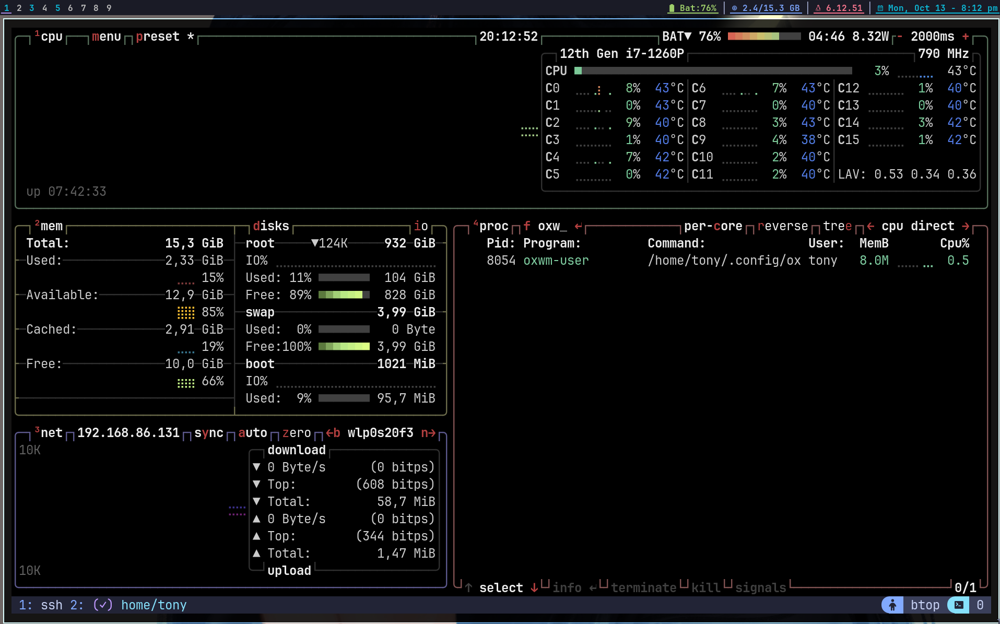

#+AUTHOR: Tony
#+STARTUP: overview

* OXWM — DWM but Better
A dynamic window manager written in Zig, inspired by dwm but designed to evolve beyond it. OXWM features a clean, functional Lua API for configuration with hot-reloading support, ditching the suckless philosophy of *"edit + recompile"*. Instead, we focus on lowering friction for users with sane defaults, LSP-powered autocomplete, and instant configuration changes without restarting your X session.

*Documentation:* [[https://ox-docs.vercel.app/][ox-docs.vercel.app]]

* Installation
** NixOS (nixpkgs)
Add Oxwm to your =configuration.nix= like so:

#+begin_src nix
{ config, pkgs, ... }:

{
  services.xserver.windowManager.oxwm.enable = true;
}
#+end_src

*** Initialize your config
After rebuilding your system with =sudo nixos-rebuild switch=, log in via your display manager.

On first launch, your initial config file will be automatically created and placed in =~/.config/oxwm/config.lua=. Edit it and reload with =Mod+Shift+R=.

*** Development setup with Nix
For development, use the provided dev shell:

#+begin_src sh
# Clone the repository
git clone https://github.com/tonybanters/oxwm
cd oxwm

# Enter the development environment
nix develop

# Build and test
zig build -Doptimize=ReleaseSmall
#+end_src

** Arch Linux

AUR: [[https://aur.archlinux.org/packages/oxwm-git][AUR URL]]
#+begin_src
yay -S oxwm-git
#+end_src
This will automatically put a desktop session file into your xsessions directory.

Manually:
Install dependencies:
#+begin_src sh
sudo pacman -S zig libx11 libxft freetype2 fontconfig libxinerama
#+end_src
See Build from source

** Building from Source
Note, on many BSD systems, the zig compiler will agressively attempt to remove debug symbols which is causing a known linker issue. Please use this method on BSD:

#+begin_src sh
git clone https://github.com/tonybanters/oxwm
cd oxwm
zig build
#+end_src

On other legacy distros, just use:

#+begin_src sh
git clone https://github.com/tonybanters/oxwm
cd oxwm
zig build -Doptimize=ReleaseSmall --prefix /usr
#+end_src

** Setting up OXWM
*** Without a display manager (startx)
Add the following to your =~/.xinitrc=:
#+begin_src sh
exec oxwm
#+end_src

Then start X with:
#+begin_src sh
startx
#+end_src

*** With a display manager
If using a display manager (LightDM, GDM, SDDM), OXWM should appear in the session list after installation.

* Configuration
OXWM uses a clean, functional Lua API for configuration. On first run, a default config is automatically created at =~/.config/oxwm/config.lua=.

** Quick Example
Here's what the new functional API looks like:

#+begin_src lua
-- Set basic options
oxwm.set_terminal("st")
oxwm.set_modkey("Mod4")
oxwm.set_tags({ "1", "2", "3", "4", "5", "6", "7", "8", "9" })

-- Configure borders
oxwm.border.set_width(2)
oxwm.border.set_focused_color("#6dade3")
oxwm.border.set_unfocused_color("#bbbbbb")

-- Configure gaps
oxwm.gaps.set_enabled(true)
oxwm.gaps.set_inner(5, 5)  -- horizontal, vertical
oxwm.gaps.set_outer(5, 5)

-- Set up keybindings
oxwm.key.bind({ "Mod4" }, "Return", oxwm.spawn("st"))
oxwm.key.bind({ "Mod4" }, "Q", oxwm.client.kill())
oxwm.key.bind({ "Mod4", "Shift" }, "Q", oxwm.quit())

-- Add status bar blocks
oxwm.bar.set_blocks({
    oxwm.bar.block.datetime({
        format = "{}",
        date_format = "%H:%M",
        interval = 60,
        color = "#0db9d7",
        underline = true,
    }),
    oxwm.bar.block.ram({
        format = "RAM: {used}/{total} GB",
        interval = 5,
        color = "#7aa2f7",
        underline = true,
    }),
})
#+end_src

** Key Configuration Areas
Edit =~/.config/oxwm/config.lua= to customize:
- Basic settings (terminal, modkey, tags)
- Borders and colors
- Window gaps
- Status bar (font, blocks, color schemes)
- Keybindings and keychords
- Layout symbols
- Autostart commands

After making changes, reload OXWM with =Mod+Shift+R=

** Creating Your Config
Generate the default config:
#+begin_src sh
oxwm --init
#+end_src

Or just start OXWM - it will create one automatically on first run. 

* Contributing
When contributing to OXWM:

1. Never commit your personal =~/.config/oxwm/config.lua=
2. Only modify =templates/config.lua= if adding new configuration options
3. Test your changes with =zig build xephyr= using Xephyr or =zig build xwayland= using Xwayland
4. Document any new features or keybindings
5. Contributions **must not** include content generated by large language models or other probabilistic
tools, including but not limited to Copilot or ChatGPT. This policy covers code, documentation, pull
requests, issues, comments, and any other contributions to the oxwm project.
* Key Bindings
Default keybindings (fully customizable in =~/.config/oxwm/config.lua=):

| Binding                | Action                            |
|------------------------+-----------------------------------|
| Super+Return           | Spawn terminal                    |
| Super+J/K              | Cycle focus through stack         |
| Super+Q                | Kill focused window               |
| Super+Shift+Q          | Quit WM                           |
| Super+Shift+R          | Hot reload WM                     |
| Super+1-9              | View tag 1-9                      |
| Super+Shift+1-9        | Move window to tag 1-9            |
| Super+Ctrl+1-9         | Toggle tag view (multi-tag)       |
| Super+Ctrl+Shift+1-9   | Toggle window tag (sticky)        |
| Super+S                | Screenshot (maim)                 |
| Super+D                | dmenu launcher                    |
| Super+A                | Toggle gaps                       |
| Super+Shift+F          | Toggle fullscreen                 |
| Super+Shift+Space      | Toggle floating                   |
| Super+F                | Set normie (floating) layout      |
| Super+C                | Set tiling layout                 |
| Super+N                | Cycle layouts                     |
| Super+Comma/Period     | Focus prev/next monitor           |
| Super+Shift+Comma/.    | Send window to prev/next monitor  |
| Super+[/]              | Decrease/increase master area     |
| Super+I/P              | Inc/dec number of master windows  |
| Super+Shift+/          | Show keybinds overlay             |
| Super+Button1 (drag)   | Move window (floating)            |
| Super+Button3 (drag)   | Resize window (floating)          |

* Features
- *Dynamic Tiling Layout* with adjustable master/stack split
  - Master area resizing (mfact)
  - Multiple master windows support (nmaster)
- *Tag-Based Workspaces* (9 tags by default)
  - Multi-tag viewing (see multiple tags at once)
  - Sticky windows (window visible on multiple tags)
- *Multiple Layouts*
  - Tiling (master/stack)
  - Normie (floating-by-default)
  - Monocle (fullscreen stacking)
  - Grid (equal-sized grid)
  - Tabbed (tabbed windows)
- *Lua Configuration System*
  - Hot reload without restarting X (=Mod+Shift+R=)
  - LSP support with type definitions and autocomplete
  - No compilation needed - instant config changes
- *Built-in Status Bar* with modular block system
  - Battery, RAM, datetime, shell commands, static text
  - Custom colors, update intervals, and underlines
  - Click-to-switch tags
  - Multi-monitor support (one bar per monitor)
- *Advanced Window Management*
  - Window focus cycling through stack
  - Fullscreen mode
  - Floating window support
  - Mouse hover to focus (follow mouse)
  - Border indicators for focused windows
  - Configurable gaps (smartgaps support)
  - Window rules (auto-tag, auto-float by class/title)
- *Multi-Monitor Support*
  - RandR multi-monitor detection
  - Independent tags per monitor
  - Move windows between monitors
- *Keychord Support*
  - Multi-key sequences (Emacs/Vim style)
  - Example: =Mod+Space= then =T= to spawn terminal
- *Persistent State*
  - Window tags persist across WM restarts
  - Uses X11 properties for state storage

* Testing with Xephyr
Test OXWM in a nested X server without affecting your current session:

#+begin_src sh
zig build xephyr
#+end_src

This starts Xephyr on display :2 and launches OXWM inside it.

For multi-monitor testing:
#+begin_src sh
zig build xephyr-multi
#+end_src

Or manually:
#+begin_src sh
Xephyr -screen 1280x800 :2 &
DISPLAY=:2 zig build run
#+end_src

* Project Structure
#+begin_src sh
src/
├── main.zig                             [Entry point - handles CLI args, config loading, WM init]
├── client.zig                           [Client/window management]
├── monitor.zig                          [Monitor handling and multi-monitor support]
├── overlay.zig                          [Overlay rendering]
├── animations.zig                       [Animation support]
│
├── config/
│   ├── config.zig                       [Config struct and defaults]
│   └── lua.zig                          [Lua config parser - loads and executes config.lua]
│
├── bar/
│   ├── bar.zig                          [Status bar with XFT support]
│   └── blocks/
│       ├── blocks.zig                   [Block system core]
│       ├── format.zig                   [Block formatting utilities]
│       ├── battery.zig                  [Battery status block]
│       ├── datetime.zig                 [Date/time formatting block]
│       ├── ram.zig                      [RAM usage block]
│       ├── cpu_temp.zig                 [CPU temperature block]
│       ├── shell.zig                    [Shell command execution block]
│       └── static.zig                   [Static text block]
│
├── layouts/
│   ├── tiling.zig                       [Tiling layout with master/stack]
│   ├── monocle.zig                      [Fullscreen stacking layout]
│   ├── floating.zig                     [Floating layout]
│   └── scrolling.zig                    [Scrolling layout]
│
└── x11/
    ├── xlib.zig                         [X11/Xlib bindings]
    ├── display.zig                      [Display management]
    └── events.zig                       [X11 event handling]

templates/
├── config.lua                           [Default config with functional API]
└── oxwm.lua                             [LSP type definitions for autocomplete]
#+end_src

* Architecture Notes
** Lua Configuration System
OXWM embeds a Lua 5.4 interpreter using Zig's C interop. The functional API is implemented in =src/config/lua.zig=:
- Each API function (e.g., =oxwm.border.set_width()=) is registered as a Lua function
- Functions modify the config state that accumulates settings
- When config execution completes, the final Config struct is produced
- Type definitions in =templates/oxwm.lua= provide LSP autocomplete and documentation

** Tag System
Tags are implemented as bitmasks (TagMask = u32), allowing windows to belong to multiple tags simultaneously. Each window has an associated TagMask stored in a HashMap. Tags persist across WM restarts using X11 properties (_NET_CURRENT_DESKTOP for selected tags, _NET_CLIENT_INFO for per-window tags).

** Status Bar
The bar uses a performance-optimized approach with a modular block system:
- Only redraws when invalidated
- Pre-calculates tag widths on creation
- Blocks update independently based on their configured intervals
- Supports custom colors and underline indicators
- Color schemes (normal/occupied/selected) control tag appearance
- Easily extensible - add new block types in src/bar/blocks/

** Layout System
The tiling layout divides the screen into a master area (left half) and stack area (right half). The master window occupies the full height of the master area, while stack windows split the stack area vertically. Gaps are configurable and can be toggled at runtime.

* TODO Current Todo List:
** PRIORITY High [0/4]
- [ ] Add Window Titles to Bar
  - Show focused window title in status bar
  - Truncate if too long
  - Update on window focus change
- [ ] Add Horizontal Scroll Layout
  - Master window on left, stack scrolls horizontally
  - Alternative to vertical tiling
- [ ] Add Hide Empty Tag Numbers Option
  - Option to hide tags with no windows
  - Configurable via =oxwm.bar.set_hide_empty_tags(bool)=
- [ ] Add Swap Stack Bind
  - Keybind to swap focused window with master
  - Similar to dwm's zoom function (=Mod+Return=)
  - Should work bidirectionally
* Development Roadmap
** Current Focus (v0.11.3)
- Implement featuers such as systray to make the bar more robust.
- Improving core window management reliability
- Maintaining Lua config and bar features while simplifying internals

** Completed Features [8/8]
- [X] Multi-monitor support with RandR
- [X] Multiple layouts (tiling, monocle, grid, tabbed, normie)
- [X] Master area resizing (mfact) and nmaster support
- [X] Window rules (per-program auto-tag, floating)
- [X] Lua configuration with hot-reload
- [X] Built-in status bar with modular blocks
- [X] Keychord support (multi-key sequences)
- [X] Tag persistence across restarts

** Future Enhancements [/]
- [ ] Scratchpad functionality
- [ ] Dynamic monitor hotplugging (currently only on startup)
- [ ] External bar support (polybar, waybar compatibility)
- [ ] Additional layouts (deck, spiral, dwindle)

* License
[[https://www.gnu.org/licenses/gpl-3.0.en.html][GPL v3]]

